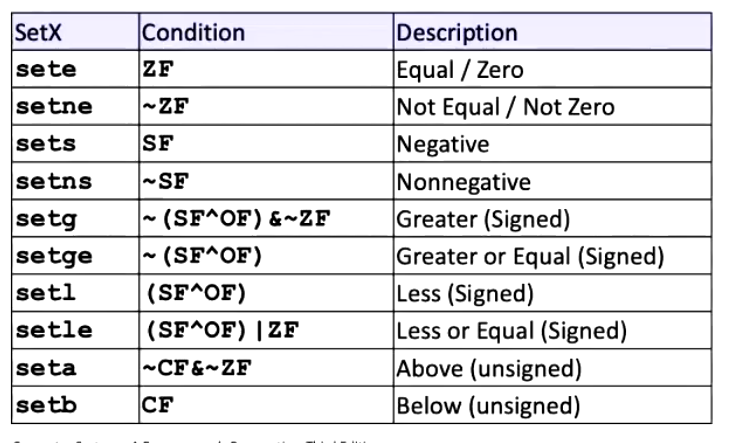

## Condition Codes (Implicit Setting)
Single Bit Registers
- CF -> Carry Flag (for unsigned)
- SF -> Sign Flag (for signed)
- ZF -> Zero Flag
- OF -> Overflow Flag (for signed)

Implicitly set (think of it as side effect) by arithmetic operations
- Example: addq Src, Dest <-> t = at + b
- CF set if carry out from most significant bit (unsigned overflow)
- ZF set if t == 0
- SF set it t < 0 (as signed)
- OF set if two's-complement (signed) overflow
Not Set by leaq

## Condition Codes (explicit setting: compare)
Explicit setting by compare instruction
- cmpq Src2, src1

## Reading Condition Codes
SetX Instructions
- Set low-order byte of destination to 0 or 1 based on combinations of condition codes
- Does no alter any of the remaining 7 bytes

SetX Instructions:
- Set single byte based on combination of condition
One of addressable byte registers
- Does not alter remaining bytes
- Typically use movzbl to finish job
    - 32-bit instructions also set upper 32 bits to 0

